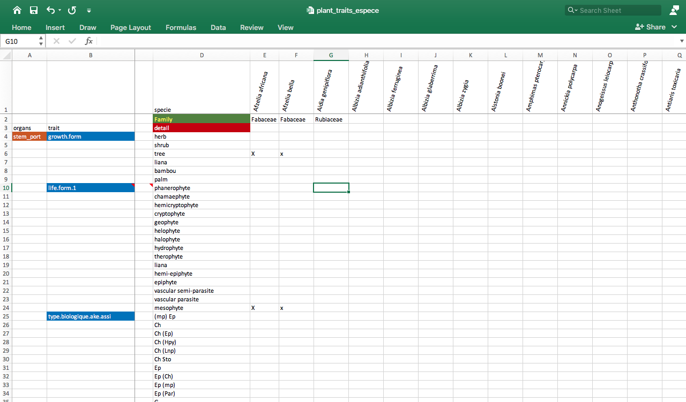

```{r setup, include=FALSE}
knitr::opts_chunk$set(echo = TRUE)
```

```{r}
#devtools::install_github("kupietz/kableExtra")
```

# Descriptif

## Projet

Clé d’identification des espèces du dispositif de Téné (Oumé).

## Site

La forêt classée de Téné (6°31'14'' N, 5°28'44'' O) est située dans le centre-ouest de la Côte d’Ivoire, dans le département d’Oumé. Elle abrite un dispositif expérimental couvrant 400 hectares. Créée en 1978 par la Société de Développement des Forêts (SODEFOR) en collaboration avec le Centre Technique des Forêts Tropicales (CTFT) — aujourd’hui connu sous le nom de Centre de Coopération Internationale en Recherche Agronomique pour le Développement (CIRAD) —, cette forêt couvre une superficie totale de 29 400 hectares de forêt dense tropicale semi-décidue [@berault].

## Contexte

L’identification des espèces végétales constitue une étape clé dans tout travail forestier. Elle est essentielle pour garantir des identifications précises des essences intégrées dans les modèles de recherche, permettant ainsi d’obtenir des conclusions aussi proches que possible de la réalité.

Traditionnellement, l’identification botanique des espèces repose sur l’expertise d’un spécialiste et est validée par la comparaison des échantillons collectés sur le terrain avec ceux conservés dans des Herbiers ou décrits dans des flores. Ainsi, la taxonomie des espèces végétales joue un rôle fondamental dans le développement de ces modèles. Par "taxonomie", nous entendons l’ensemble des processus visant à identifier, nommer et classer les plantes [@stuessy].

La formation des étudiants, destinés à mener des études en forêt, exige une maîtrise des traits morphologiques essentiels à l’identification des espèces végétales. Cette identification repose sur l’utilisation d’outils tels qu’un herbier, une flore ou une clé d’identification.

## Objectif général

Contribuer à la formation des étudiants en Sciences Forestières.

## Objectifs spécifiques

- Identifier les caractères morphologiques des espèces inventoriées à Téné ;
- Mettre à disposition des étudiants un outil didactique qui facilitera l’identification des espèces végétales à partir de traits morphologiques.

# Définition

De manière évidente, en taxonomie les traits morphologiques sont habituellement utilisés par les débutants pour l’identification des espèces. La clé de détermination est un outil d'identification des taxons (espèce, genre, famille, etc) reposant sur une succession de choix d'alternatifs ou de questions portant sur les caractères d'un spécimen qui permet de l'identifier, étape par étape ; grâce à ses attributs. Ces caractères permettent d'assigner à un taxon scientifiquement décrit et nommé, et donc de lui donner un nom si les questions sont répondus correctement [@Kusumawardani].

Nous devons la notion de clé dichotomique à l’Anglais Richard Wall en 1689. Son intention était de produire une table des plantes herbacées identifiée en Anglais dans le but de faciliter leur identification [@griffing].


# Codage des données

## Obtention des traits

L’obtention des traits fonctionnels se feront par le biais de la bibliographie (sites Internet, articles scientifiques, flores) et si possible des missions de terrain.

## Traits retenus

Un total de 76 traits fonctionnels a été retenu. Quelques un de ces traits seront retenus pour les besoins de la réalisation de la clé d’identification taxonomique. D’autres traits pourront être utilisés pour la réalisation d’une base de données interactive beaucoup plus générale.

Sur la base de la bibliographie et du package TR8 [@bocci] les traits suivants ont été retenus :

```{r, data_import, message=FALSE, warning=FALSE, echo=FALSE, include=FALSE}
library(readxl)
suppressMessages(library(knitr))
traits2<- read_excel("traits2.xlsx")
traits1 <- read_excel("traits1.xlsx")
```


```{r, message=FALSE, warning=FALSE, echo = FALSE}
library(kableExtra)
kable(traits2, "html", caption ="Traits retenus (1)") %>%
  kable_styling(full_width = FALSE, position = "float_left")%>%
  kable_styling(font_size = 12, bootstrap_options = c("striped", "hover"))
kable(traits1, "html", caption ="Traits retenus (2)") %>%
  kable_styling(full_width = FALSE, position = "right")%>%
  kable_styling(font_size = 12, bootstrap_options = c("striped", "hover"))
```

## Spreadsheet score
Le _spreadsheet score_ se fera selon le modèle de LudiBuilder [@ristaino ; @zuquin]. Dans ce modèle, les espèces sont disposées en colonnes et les caractères retenus dans une ligne. Ensuite, à l'intercession du caractère et de l'espèce, est affecté un score (x) si l'espèce possède le caractère.

Le logiciel @msexcel a été utilisé pour la réalisation de la base de données (traitsXespeces). 

```{r screenshort, echo=FALSE, fig.cap="_Figure 1. Capture d'écran du spreadsheet score_", out.width = '100%'}

```

## Des exemples de bases de données

Database Bioflore développée par le _Centre for Environmental Research_ (Helmholtz) [@Biolflor]. 


## Vérification du nom des taxons et des familles
La vérification du nom des taxons se fera suivant la base du Conservatoire et Jardin botaniques de la ville de Genève [@cjb] et le package [@worldflora] . Le package plantlist de @ZhangJ et BIOMASS de @biomass seront utilisés pour la vérification de la conformité des familles des plantes avec APG IV [@apgiv].

## Clé d'identification en ligne des espèces
Il existe à ce jours plusieurs outils de référence interactif sous la forme de site web. Il s'agit par exemple des outils développés par The Open University [@ispot], le National Science Foundation [@Gobot], la flore écologique de belgique [@florebelg] et le Neotropical Flowering Plant Families [@kew]. En plus de ces sites, s'ajoute la clés d'identification taxonomique des espèces de la Guyane [@Mori]. 

En Guyane, un outils numrique a été mis en place appelé e-flora dans le but de vulgariser les conaissances acquises sur la forêt [@Mori2020].

## Approches
Comme dans toutes les approches de modélisation et de machine learning, il est intéressant de déterminer le caractère botanique ( _predictor_, _x-variable_, indépendant variable,) qui a le plus d’importance ( _feature importance_) dans la détermination du nom (valeur à prédire, _response variable_, _dependant variable, y-variable_ ) de l’espèce, qui represente alors la réponse attendue.

_Il est important d'avoir une base de données matricielles pour par la suite appliquer des méthodes de machine learniing afin de determiner les descripteurs caractéristiques des espèces._

Chaque espèce pourra se voir affectée un code numérique converti en valeurs catégorielles [@MorseetTadivel].


# Application

## lucidcentral

LucidBuilder [@LucidCentral] est une application utilisée pour la réalisation de clés d'identification. Le Lucid Builder  permet de créer rapidement et facilement des clés d'identification et de diagnostic riches et interactives sur n'importe quel sujet.

## Xper 3

Xper 3 [@xper3] est une plateforme collaborative de gestion de données de biodiversité. Lors de l'étude sur la diversité des Pterydoohytes au Togo, Cette platforme a été utlisée par @abotis. Elle permet non seulement de stocker et d'éditer des données descriptives en ligne mais aussi avoir la possibilité de partager ces données avec des utilisateurs tiers, rendant ainsi possible la gestion collaborative de données descriptives.Comme outil d'identification, Xper3 est muni de plusieurs outils d'identification à savoir : un module d'identification interactive et un module de génération de clés d'identification. Enfin, Xper3 est muni de plusieurs outils d'analyse qui aident à  assurer la cohérence des données descriptives.

Il est capable de calculer l'indexe Xper qui correspond à la valeur discriminante pour chaque descripteur. Il se comporte comme un indice de similarité, il permet en plus de dterminer le descripeur qui permet de mieux décrire une espèce. Il varie de 0 à 1.

Il existe une version hors ligne de Xper 3 qui est Xper2 [@xper3].
A la différence de LucidBuilder [@LucidCentral], Xper 3 est une application gratuite.


## Logiciel et IDE

Du fait des questions de licence et de la reproductibilité de la recherche, nous nous proposons d'utiliser le logiciel R [@r].

Le logiciel R et l'interface graphique RStudio [@RCoreTeam] seront utilisés pour la réalisation de la clé d'identification.

### Exemples de codes

```bat
install.packages("TR8")
library(TR8)
```
### Réalisation de la clé dichotomique en exemple
Le package dichotomousKey [@dichoto] sera utilisé pour la réalisation de la clé. L'activation du package se fera de la manière suivante :

```html
install.packages("devtools")
library(devtools)
devtools::install_github('HaoLi111/dichotomousKey')
library(dichotomousKey)
```
La méthode de l'arbre de régression se fera à partir du package tree [@tree]. L'utilisation du package se fera de la façon suivante : 

```bat
install.packages("tree")
Brian Ripley
library(tree)
model<-tree(species~ .,epilobium, mindev =0,minsize = 2)
summary(model)
View(model)
```


## Illustrations photographiques
Avoir pour chaque plante, trois (3) photographies, de pieds différents et trois (3) sur le même pied.

Les illustrations d'éléments caractéristiques des plantes seront faite à partir d'un appareil photo par la méthode de la macrophotographie [@PerkinsMendel].

## Avantages du projet
Les données récupérées dans ce projet pourraient servir à enrichir d’autres bases de données et mettre à la disposition des étudiants, un outils d'apprentissage de la Botanique.

## Perspectives
Rédaction d’un guide de terrain pour l’identification des espèces de la *forêt de Téné*. Ce guide sera illustré. 

Il pourra servir comme outil pédagogique.

# Data Wrangling
## Importation

Le jeu de données est importé pour l'analyse depuis le dossier source.

```{r importation_base_initiale, echo=TRUE, message=FALSE, warnings=FALSE, results='asis'}
library(dplyr)
library(readr)

data_final_for_Ehouman <- read_delim("data_final_for_Ehouman.csv", ";", locale=locale(decimal_mark = ","),  escape_double = FALSE, trim_ws = TRUE)


# data_final_for_Ehouman <- read_delim("/Volumes/USER-1/Projets/Forest/Téné/data_final_for_Ehouman.csv", 
#                                      ";", locale=locale(decimal_mark = ","),  escape_double = FALSE, trim_ws = TRUE)

library(kableExtra) # Pour visualiser le tableau dans un fichier rmarkdown
dt0 <- data_final_for_Ehouman[1:5, ]

dt0 %>%
    kable(format = "html", caption = "Tableau 2. Echantillon des 5 premières lignes des taxons de Téné ") %>%

```


## Renommer le dataframe
```{r renommer_convert_base, echo=TRUE, message=TRUE, warnings=FALSE, results='asis'}
TeneForest<-data_final_for_Ehouman  # Renommer le dataframe
TeneForest <- as.data.frame(TeneForest) # convertir le tableau en data.frame

library(kableExtra)
dt1 <- TeneForest[1:5, ] # passer les 5 premières lignes du tableau dans un dataframe dt1
dt1 %>%
    kable(format = "html", caption = "Tableau 3. Echantillon des 5 premières lignes des taxons de Téné ") %>%
                                                                                                      kable_styling()
```

## Description du tableau de données

```{r}
glimpse(TeneForest) # afficher les variable du tableau
```


## Création de la colone binomiale

La colonne binomiale est créée à partir de l'union des colonnes genus.y, species.y

Ajouter une colone binome.y à partir du collage des colonnes genus.y et species.y

```{r ajouter_colonne, echo=TRUE, message=TRUE, warnings=FALSE, results='asis'}
library(dplyr)
library(kableExtra)
#glimpse(TeneForest) # vérifier le nombre de colonnes avant d'appliquer l'opération
TeneForest<-within(TeneForest, binome.y <- paste(genus.y,species.y,sep=' '))
dt2 <- TeneForest[1:5, c(4:6, 11) ] # passer les 5 premières lignes du tableau dans un dataframe dt2
#ou

#library(tidyr)
#TeneForest<-TeneForest %>% 
#            unite("binome.y", genus.y:species.y, sep = " ", na.rm = TRUE, remove = FALSE)
#glimpse(TeneForest) # vérifier le nombre de colonnes après application de l'opération

dt2 %>%
    kable(format = "html", caption = "Tableau 4. Echantillon des 5 premières lignes des taxons de Téné ") %>%
                                                                                                      kable_styling()
```

## Vérifier la conformité des familles à l'aide de BIOMASS
Le package BIOMASS avec le fonction _correctTaxo()_ ne fonctionne pas lorsque le Package n'est pas à jour. Dans ce cas, il y a un problème de time out. 

### Pacakge BIOMASS
Vérification et correction des genres selon  APG avec BIOMASS.

```{r, echo=FALSE, message=FALSE, warning=FALSE, results='asis'}
library(BIOMASS)

Taxo <- correctTaxo(genus = TeneForest$genus.y, species = TeneForest$species.y, useCache = T, verbose = F)

TeneForest$genusCorr <- Taxo$genusCorrected
TeneForest$speciesCorr <- Taxo$speciesCorrected

dt3 <- TeneForest[1:5, ] # passer les 5 premières lignes du tableau dans un dataframe dt1

dt3 %>%
    kable(format = "html", caption = "Tableau 5. Echantillon des 5 premières ligne de la liste floristique de Téné avec les noms de taxoncorrigés") %>%
kable_styling()
```

Nous remarquons que BIOMASS ne corrige pas *Vernonia conferta*, ce qui aurait dû être corrigé par *Vernonia doniana* DC. 

### Optenir le nom des familles selon APG III (1)
Qu'en est-il de la correction au niveau des familles ?

```{r getTaxonomy, echo=TRUE, message=TRUE, warnings=FALSE, results='asis'}
APG <- getTaxonomy(TeneForest$genusCorr, findOrder = T)
TeneForest$familyAPG <- APG$family
TeneForest$orderAPG <- APG$order
dt4 <- TeneForest[1:5, ]

dt4 %>%
    kable(format = "html", caption = "Tableau 6. Echantillon des 5 premières ligne de la liste floristique de Téné avec les familles comparées à APG par Biomass") %>%
  kable_styling()
```

### Optenir le nom des familles selon APG III (2)

**Applique le critère de vrai ou faux**

Afficher là où des corrections ont été apportées au niveau des familles.

Dans le tableau ajouter une colonne pour voir où les corrections ont été apportées selon APG
Si il y'a eu correction, mettre *FALSE*, si non mettre *TRUE*. 

```{r match_col, echo=FALSE, message=FALSE, warnings=FALSE, results='asis'}
TeneForest$match <- ifelse(TeneForest$family==TeneForest$familyAPG, 'TRUE', 'FALSE')

dt5 <- TeneForest[1:5, ]

library(kableExtra)

dt5 %>%
  kable(format = "html", caption = "Tableau 7. Echantillon des 5 premières ligne de la liste floristique de Téné") %>%
  kable_styling()

```

**Filtrer le tableau pour afficher les FALSE**

Nous souhaitons afficher les lignes pour lesquelles il y a eu une correction 

```{r maching, echo=TRUE, message=TRUE, warnings=FALSE, results='asis'}

dt6<- filter(TeneForest, match == "FALSE")

library(kableExtra)

dt6 %>%
  kable() %>%
  kable_styling()
```


## Résultats avec BIOMASS
```
Tout porte à croire que BIOMASS n'a pas identifié les familles qui ne sont pas conformes à APG III ou APG IV. Il nous semble que BIOMASS conserve la taxonomie **Cronquist**. 

Ainsi, les familles comme Compositeae et Greyiaceae sont présentes dans la base. Elle n'ont pas été corrigées selon APGIV avec le package BIOMASS, respectivement en Asteraceae et en Melianthaceae comme nous nous y attendions.
```

Nous allons donc opter pour le package *plantlist*

## Importation du package
### Installer plantlist pour avoir accès à la base de données de *ThePlantList*

```{r, echo=TRUE, message=FALSE, warning=FALSE, results='asis'}

#remotes::install_github("helixcn/plantlist") # pour installer le packge via github

### Lancer le package
library(plantlist)

### Sauvegarder les familles dans un _charactor vector_
sp <- unique(TeneForest$family)

### Appliquer la fonction TPL au _charactor vector_ qui contient les familles

res <- TPL(sp)

### Afficher le résultat sous la forme de tableau
taxa.table(res)
```

### Résultats
Les familles et les espèces suivantes ont été identifiées et corrigées (pour les familles) :

NA/Greyiaceae/Greyiaceae #  Absente de la liste

Bersama abyssinica (Greyiaceae) #  Bersama abyssinica Fresen. (Melianthaceae) 

Vernonia conferta Benth.(Compositae) #  Vernonia doniana DC. (Asteraceae) 

### Appliquer les corrections
Remplacer *Greyiaceae* par *Melianthaceae* dans la base de données
```{r remplace1, echo=TRUE, message=TRUE, warnings=FALSE, results='asis'}
TeneForest[TeneForest == "Greyiaceae"] <- "Melianthaceae"
```

Remplacer *Compositae* par *Asteraceae* dans la base de données

```{r remplace2, echo=TRUE, message=TRUE, warnings=FALSE, results='asis'}
TeneForest[TeneForest == "Compositae"] <- "Asteraceae"
```

Remplacer *conferta* par *doniana* dans la base de données.

```{r remplace3, echo=TRUE, message=TRUE, warnings=FALSE, results='asis'}
TeneForest[TeneForest == "conferta"] <- "doniana"


## ou par l'option dplyr

## TeneForest <- TeneForest %>% 
##                           mutate_all(str_replace_all, "conferta", "doniana")
``` 


Vérifier si les modifications apportées ont été intrégrées dans le tableau.

```{r plantlist_confirmation, echo=TRUE, message=TRUE, warnings=FALSE, results='asis'}

#remotes::install_github("helixcn/plantlist") # pour installer le packge via github

### Lancer le package
###library(plantlist)
### sauvegarder les familles dans un charactor vector
sp <- unique(TeneForest$family)

### Appliquer les fonction au charactor vector
res <- TPL(sp)

### Afficher sous la forme de tableau
taxa.table(res)
```

On peut observer que les corretions ont été prises en compte.

Il faudra verifier la base selon CJB pour s'assurer que les autres familles sont conformes à APGIV.

## Richesse floristique
### selectionner les colonnes
Quatres colonnes seront selectionnées pour l'analyse suivant la présentation proposée par le package TaxaRich. Il s'agit de genus.y, species.y, binome.y et family.

```{r select, echo=TRUE, message=TRUE, warnings=FALSE, results='asis'}
TeneForest_flora<-TeneForest %>% 
                              select(genus.y, species.y, binome.y, family)
```

### Retenir les lignes uniques pour les trois colones
La richesse spécifique peut être déterminée en déterminant le nombre de ligne unique dans le tableau :

```{r unique_rows, echo=FALSE, message=FALSE, warnings=FALSE, results='asis'}
library(dplyr)
TeneForest_rich <-distinct(TeneForest_flora, .keep_all = TRUE)
library(kableExtra)

dt7 <- TeneForest_rich[1:5, ]

dt7 %>%
  kable(format = "html", caption = "Tableau 8. Echantillon de la liste des espèces du dispositif de Téné ") %>%
  kable_styling()
```

### Richesse spécifique
Pour les calculs suivants, installer le package TaxaRich [@taxarich].

```{r taxaRich, echo=TRUE, message=TRUE, warnings=TRUE}
 install.packages("remotes") # installation 
 remotes::install_github("EhoumanEvans/TaxaRich") # Installation depuis github

library(TaxaRich)
```


La richesse spéfifique dans le dispositif de Téné est de :

```{r riches_spe, echo=FALSE, message=FALSE, warnings=FALSE, results='asis'}
length(unique(TeneForest_rich$binome.y))
```


Le nombre de familles botaniques est de :
```{r taxaRich_fam, echo=FALSE, message=FALSE, warnings=FALSE, results='asis'}
# Nombre de famille
length(unique(TeneForest_rich$family)) #  51 ou
```

### Nombre d'espèces par familles
```{r taxaRich_fam3, echo=FALSE, message=FALSE, warnings=FALSE, results='asis'}
# Nombre d'espèces par famille
#nbfam(TeneForest_rich)
nbfam_dtf<-nbfam(TeneForest_rich)
dtf_fm<-arrange(nbfam_dtf, desc(Number.of.species))

dtf_fm %>%
  kable(format = "html", caption = "Tableau 9. Nombre d'espèces par familles") %>%
  kable_styling(full_width = F)
```


Filter le tableau 9 pour garder les familles de deux (5) à trente (30) espèces.

```{r subset_famille, echo=FALSE, message=FALSE, warnings=FALSE, results='asis'}
dtf_fam_5_30 <- dtf_fm %>% 
              filter(Number.of.species >=5)
```

Visualiser les résulats sur un graphique en mettant en relief les familles qui ont plus de 5 espèces par familles.

```{r, warning=FALSE,message=FALSE, fig.height=12, fig.width=12}
 
library(ggplot2)
dtf_fm_max <- dtf_fam_5_30  %>%
                      mutate(max_families=ifelse(Number.of.species >=10, "1", "0"))

p<-dtf_fm_max %>%
  ggplot(aes(x = Families, y = Number.of.species, fill=max_families)) +
  geom_col(width=0.5)+
  scale_fill_manual( values = c( "1"="red", "0"="darkgray" ), guide = FALSE )+
  labs(title=" ") +
  labs(title = "  ",
              subtitle = " ",
              caption = "Figure 2. Familles botaniques les plus diversifiées")

p + theme(axis.text.x = element_text(angle = 90, vjust = 0.5, hjust=1), plot.caption = element_text(hjust = 0.5, size=16)) 
```


### Nombre d'espèces par genres
```{r taxaRich_genre2, echo=FALSE, message=FALSE, warnings=FALSE, results='asis'}
# Nombre d'espèces par genre
# nbgr(TeneForest_rich)
nbgenre_dtf<-nbgr(TeneForest_rich)
dtf_gr<-arrange(nbgenre_dtf, desc(Number.of.species))

dtf_gr %>%
  kable(format = "html", caption = "Tableau 10. Nombre d'espèces par genres") %>%
  kable_paper("hover", full_width = F)
```

Filter le tableau 10 de manière à garder les genres dont le nombre d'espèce est compris entre deux (2) et sept (7).

```{r subset, echo=FALSE, message=FALSE, warnings=FALSE, results='asis'}
dtf_gr_2_7 <- dtf_gr %>% 
              filter(Number.of.species >=2)
```


```{r, warning=FALSE,message=FALSE, fig.height=12, fig.width=12}
library(ggplot2)
p<-ggplot(data=dtf_gr_2_7, aes(x=Genera, y=Number.of.species)) +
  geom_bar(stat="identity", fill="steelblue")+
  theme_minimal() +
  labs(title = "  ",
              subtitle = " ",
              caption = "Figure 3. Genres botaniques les plus diversifiées")

p + theme(axis.text.x = element_text(angle = 90, vjust = 0.5, hjust=1), plot.caption = element_text(hjust = 0.5, size=16)) 
```


Les graphiques suivants permettent de mettre l'accent sur les genres ayant un nombre d'espèces supérieur à 7.

```{r, warning=FALSE,message=FALSE, fig.height=12, fig.width=12}
 
library(ggplot2)
dtf_gr_max <- dtf_gr_2_7  %>%
                      mutate(max_genera=ifelse(Number.of.species >=5, "1", "0"))

p<-dtf_gr_max %>%
  ggplot(aes(x = Genera, y = Number.of.species, fill=max_genera)) +
  geom_col(width=0.5) +
labs(title = "  ",
              subtitle = " ",
              caption = "Figure 4. Genres botaniques les plus diversifiés")

p + theme(axis.text.x = element_text(angle = 90, vjust = 0.5, hjust=1), plot.caption = element_text(hjust = 0.5, size=16)) 
```


```{r, warning=FALSE,message=FALSE, fig.height=12, fig.width=12}
library(ggplot2)
dtf_gr_max <- dtf_gr_2_7  %>%
                      mutate(max_genera=ifelse(Number.of.species >=5, "1", "0"))

p<-dtf_gr_max %>%
  ggplot(aes(x = Genera, y = Number.of.species, fill=max_genera)) +
  geom_col(width=0.5)+
  scale_fill_manual( values = c( "1"="red", "0"="darkgray" ), guide = FALSE )+
  labs(title=" ") +
  labs(title = "  ",
              subtitle = " ",
              caption = "Figure 5. Genres botaniques les plus diversifiées avec les ")

p + theme(axis.text.x = element_text(angle = 90, vjust = 0.5, hjust=1), plot.caption = element_text(hjust = 0.5, size=16)) 
```

## Corrections à apporter : Mise à jour du nom des familles
 
Un total de 21 472 observations a été réalisé lors du recensement des espèces végétales à Téné. La richesse floristique est de 199 espèces. La vérification de la conformité des familles avec APG IV et du nom des espèces a conduit à isoler *24 espèces*. 

Pour ces espèces, ce sont soit le nom soit la famille botanique qui devra être révisé et la rendre conforme à APG IV suivant les données actualisées de Cjb et theplantlist.

Après vérification des noms de taxon dans la base cjb et theplantlist, les espèces qui meriteraient correction sont consignées dans le tableau 11.

```{r tab}
library(knitr)
library(dplyr)
library(kableExtra)
revised_tene_flora <- read_excel("revised_tene_flora.xlsx")

revised_tene_flora %>%
  kbl(caption = "Tableau 11. Liste des espèces dont le nom des taxons devrait être revisé") %>%
  kable_classic(full_width = F, html_font = "Palatino Linotype")%>%
  footnote(c("genusCor : genre corrigé",
             "speciesCor : épithète spécifique corrigé",
             "source : source de l'information"),
           threeparttable=T)
```


# Discussion des familles
Les familles qu'il faudra verifier et mettre à jours sont : 

```{r }
revised_tene_flora <-revised_tene_flora %>% 
                                        filter(family.APGIV != "NA")
revised_tene_flora <- revised_tene_flora %>% 
                                         arrange((family.APGIV))
```

## Achariaceae

S'agissant de la famille des Achariaceae, le genre Caloncoba (Achariaceae) est revisé en Oncoba (Salicaceae). En effet, 

l'espèce _Caloncoba brevipes_ (Stapf) Gilg (*Flacourtiaceae*) selon APG III elle est reclassée dans la famille des _ACHARIACEAE_  [@reveal]. Mais, @cjb a publié que ce nom de taxon est remplacé par _Oncoba brevipes_ Stapf (Salicaceae). 

Du coup, deux modifications sont à apporter à la base de données, une concernant le genre l'autre concernant la famille.

## Compositae

Pour l'espèce _Vernonia conferta_ (Compositae), la famille des _Compositae_ selon  @reveal et @apgiv est renommmé _Asteraceae_. Cependant, cette dénomination est toujours conservée par certaines institions comme le Royal Botanic Gardens, Kew. Ce dernièr endorse également la nomenclature *Leguminosae*.

Le terme *Compositae* pourrait être remplacé par *Asteraceae*.


## Olacaceae

Selon APG III, la famille des *Aptandraceae* était enregistrée dans la famille des *Olacaceae* [@reveal]. 
Dans la classification actuelle des Angiospermes @apgiv, les *Olacaceae* ont été subdivisé en huit (8) familles. Ce sont : Aptandraceae, Coulaceae, Erythropalaceae, Octoknemaceae, Olacaceae s.s., Schoepfiaceae, Strombosiaceae et Ximeniaceae [@apgiv]. Ainsi, le genre *Aptandra* est désormais classé parmi les *Aptandraceae*. _Aptandra zenkeri_ (Olacaceae) est desormais _Aptandra zenkeri_ (Aptandraceae). La famille des *Olacaceae* pourrait être remplacée par la famille des *Aptandraceae* pour cette espèce.

En ce qui concerne _Ongokea gore_ (Olacaceae), le genre *Ongokea* est plus proche du genre *Aptandra* [@malecot]. Il s'agit de la seule espèce du genre. Le genre *Ongokea* est desormais classé dans la famille des *Aptandraceae* [@Schoch; @cjb; @gbif].

# Discussion des espèces

La révision du nom des espèces consiste soit en des affectations dans des nouveaux genres soit en des changements de l'épithète spécifique. Pour chaque nouveau taxon, la source de l'information est mise entre parenthèse.


_Baphia bancoensis_ est rejeté pour _Baphia pubescens_ [@cjb].

_Bridelia aubrevillei_ est rejeté pour _Bridelia	ndellensis_ [@cjb] ou _Bridelia grandis _ [@plantlist].

_Caloncoba gilgiana_ est rejeté pour _Oncoba gilgiana_ [@cjb].

_Dictyandra arborescens_ est rejeté pour _Leptactina arborescens_ [@cjb].

_Fagara zanthoxyloides_  est rejeté pour _Zanthoxylum zanthoxyloides_ [@cjb; @plantlist].

_Ficus capensis_ est rejeté pour _Ficus sur_ [@cjb; @plantlist].

_Ficus goliath_ est rejeté pour _Ficus recurvata_ [@cjb; @plantlist].

_Caloncoba gilgiana_ est rejeté pour _Oncoba gilgiana_ [@cjb].

_Guarea cedrata_ est rejeté pour _Leplaea cedrata_ [@cjb].

_Hymenostegia afzelii_ est rejeté pour _Annea afzelii_ [@cjb].

_Ochthocosmus africanus_ est rejeté pour _Phyllocosmus africanus_ [@cjb; @plantlist].

_Pachystela brevipes_ est rejeté pour _Synsepalum brevipes_ [@cjb; @plantlist].

_Polyalthia oliveri_ est rejeté pour _Greenwayodendron oliveri_ [@cjb].

_Teclea verdoorniana_ est rejeté pour _Vepris verdoorniana_ [@cjb; @plantlist].

_Vernonia conferta_ est rejeté pour _Vernonia doniana_ [@cjb] et _Brenandendron donianum_ [@plantlist]


# Session Information

```{r, warning=FALSE,message=FALSE}
sessionInfo()
```


# Références
